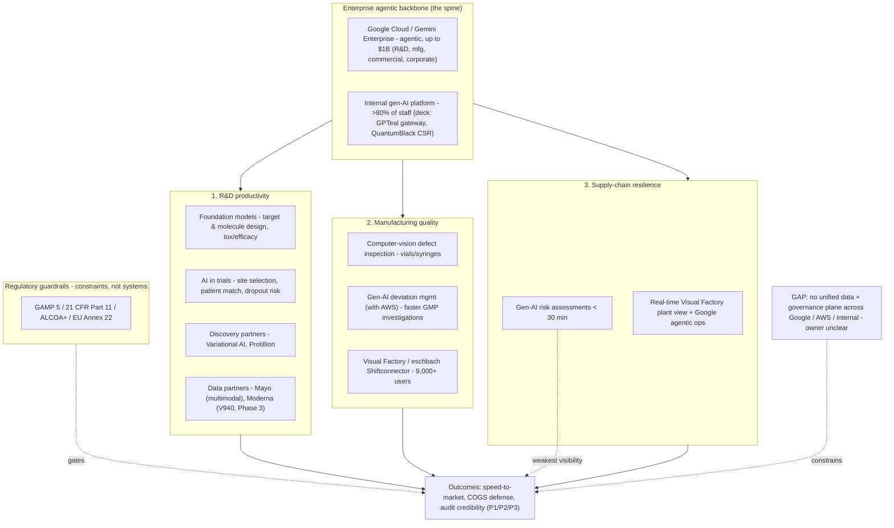

# Merck (MSD) - Current-State Architecture

### Answering the 5-step architecture research framework (Tech Stack, Limitations, Patterns, Owners, Personas), grounded in the research docs and identified business pressures

*Public sources, as of June 2026. Spine = `Merck-AI-Intelligence-Brief.md`. Companion: `Merck-Future-State-Azure-Architecture.md`.*

> **Scope:** Merck & Co., Inc. (Rahway, NJ; "MSD" outside US/Canada). This is the **current state** - what Merck has and does today - and is **vendor-neutral** (Google, AWS, internal, on-prem). The Azure target state lives in the companion future-state doc.
>
> **Provenance tags** *(so every line is traceable to research, per the quality bar):*
> - **[brief]** = documented in `Merck-AI-Intelligence-Brief.md` (primary research doc)
> - **[deck]** = from the *Grounded in the Customer* pressure deck and its cited sources (AWS blog, Rephine, BCG, Fierce Pharma, NAM, ISPE)
> - **[H]** = hypothesis, **not** in either research artifact - validate live

---

## Business pressures driving the assessment

| ID | Business pressure | Source |
| --- | --- | --- |
| **P1** | Keytruda 2028 patent cliff (~$29.5B, ~46% of 2024 sales) - defend revenue + COGS + speed | BioSpace, Sep 2025 [deck] |
| **P2** | Submission speed = revenue (~$1-3M per day earlier) | Yseop, 2026 [deck] |
| **P3** | Data integrity / audit credibility gates everything (FDA/EMA) | Rephine, Sep 2025 [deck] |
| **P4** | Investigations & documentation = top regulatory pain | ISPE iSpeak, Nov 2025 [deck] |
| **P5** | Scientists stuck copyediting (talent leakage) | R. Kim, CTO Merck (NAM, Mar 2025) [deck] |
| **P6** | AI-at-scale arms race vs peers | Sanofi, Jun 2023 [deck] |
| **P7** | Value-capture gap - 24% of firms (10% medtech) realize GenAI value | BCG Mar 2025; Fierce Pharma Jun 2026 [deck] |
| **P8** | Supply chain resilience - cold chain, shortages | Merck "5 ways" Jan 2026 [brief] |

---

## Step 1 - Tech Stack (current state)
*"Summarize Merck's digital transformation architecture - core platforms, cloud strategy, ERP, domain systems, data platforms, current AI/ML."* - drives **P1, P2, P6**

Structured to mirror the brief: an emerging **agentic backbone** sitting over the brief's **three domains** (R&D, Manufacturing, Supply Chain).

**Enterprise agentic backbone (the strategic spine)**
- **Google Cloud / Gemini Enterprise** - agentic platform, *up to* **$1B** multi-year (Apr 2026), across **R&D, manufacturing, commercial and corporate** functions **[brief]**
- **Internal gen-AI platform** (**>80% of staff**): clinical study report first drafts **2-3 weeks -> 3-4 days**, **50% fewer errors** **[brief]** *(deck names the secure LLM gateway **GPTeal** and CSR tooling on **McKinsey QuantumBlack**)*

**1. R&D productivity**
- **Foundation models** for target discovery, molecular design, and pre-lab efficacy/toxicity prediction **[brief]**
- **AI in trials** - site selection, patient matching, dropout-risk prediction **[brief]**
- Discovery partners: **Variational AI** (generative small molecules), **Protillion** (antibodies) **[brief]**
- Data partners: **Mayo Clinic** (multimodal clinical + genomic, "virtual-cell" AI, Feb 2026), **Moderna** (**V940 / mRNA-4157**, now **Phase 3**) **[brief]**

**2. Manufacturing quality**
- **Computer-vision** defect inspection of vials/syringes **[brief]**
- **Generative-AI deviation management (with AWS)** -> faster GMP investigations **[brief]** *(deck source: AWS Bedrock + OpenSearch RAG)*
- **Visual Factory / eschbach Shiftconnector** (Oct 2025) - **9,000+ users** in under 5 months; single source of truth for deviations and handovers **[brief]**

**3. Supply-chain resilience**
- **Gen-AI risk assessments in <30 minutes** flag products/sites hit by disruptions **[brief]**
- Real-time **Visual Factory** plant view; **Google Cloud** agentic ops extend resilience enterprise-wide **[brief]**

**Current AI/ML maturity:** R&D strongest, manufacturing digitally advanced and evolving toward predictive AI, **supply chain least visible** of the three. **[brief]**

**Not disclosed in the research (validate before relying on):** core ERP (e.g., SAP S/4HANA), QMS platform, process historian / analytics (e.g., OSIsoft PI + Seeq), any Azure footprint, vector DB / knowledge-graph layer. **[H]**

---

## Step 2 - Limitations
*"What challenges has Merck faced modernizing its stack or operationalizing AI?"* - drives **P3, P4, P7**

**From the brief (Strategic Implications + Key Risks):**
- **Regulatory acceptance** of AI-generated documents/decisions (FDA/EMA) **[brief]**
- **Data privacy & governance** - Mayo clinical/genomic and patient data **[brief]**
- **Model governance in GMP** - validated state, audit trails, model drift **[brief]**
- **Partner / vendor dependency** - Google Cloud lock-in; Moderna program risk **[brief]**
- **On-trend, not clearly ahead** vs Pfizer, Novartis, Lilly - edge comes from **execution + proprietary data, not IP** **[brief]**
- **IP posture** - few *publicly visible* AI-method patents; moat = **data + platforms + partnerships** **[brief]**
- **Supply chain** under-disclosed / weakest visibility of the three domains **[brief]**

**Reinforced by the deck's cited evidence:**
- **Value-capture gap** - only 24% of firms / 10% in medtech realize GenAI value **[deck - BCG]**
- **Pilot != production** - "a confident summary it cannot source has handed [QA] a new liability" **[deck - Fierce Pharma]**
- **Auditability burden** - AI must be decision *support*, fully traceable under GAMP 5 / 21 CFR Part 11 / ALCOA+ **[deck - Rephine]**
- **Regulatory moving target** - FDA AI guidance still draft (Jan 2025); EU GMP **Annex 22** enforcement 2027-28 **[deck]**
- **Multi-cloud governance** - no clear owner of the quality-data backbone across AWS / Google / internal **[H - slide 6 must-validate; aligns to brief "model governance" + "vendor dependency" risks]**

---

## Step 3 - Patterns (currently adopted / emerging)
*"What modern reference architectures and design patterns are emerging in pharma?"* - drives **P2, P3, P4, P8**

**From the brief:**
- **Agentic enterprise backbone** replacing point tools (Gemini Enterprise) **[brief]**
- **Partnership-led layering** - infrastructure (Google) + clinical data (Mayo) + biotech AI (Moderna / Variational / Protillion) **[brief]**

**Emerging operating patterns (deck-evidenced):**
- **RAG over proprietary GxP knowledge** (deviations, precedent) **[deck]**
- **Human-in-the-loop "first draft for review" + four-eyes sign-off** **[deck]**
- **Validated-AI pattern** - GAMP 5 + Part 11 + ALCOA+ + Annex 22 critical/non-critical classification **[deck]**
- **Secure enterprise LLM gateway** (GPTeal) abstracting providers **[deck]**
- **Predictive quality + demand forecasting** for supply resilience **[deck / emerging]**
- **PV / AE triage ~10x throughput** with mandated human oversight **[deck]**

---

## Step 4 - Owners -> Domains
*"Who leads digital transformation, core operations, IT/platform engineering, innovation? Map roles to architectural focus."* - drives **P1 (CFO), P3 (Quality), P2/P5 (R&D), all (CIO)**

*Source: Customer Pressure deck (C-suite map, slide 4) - **not** in the brief.* **[deck]** *Validate live - titles and remits move; confirm before outreach.*

| Leader | Architectural domain | What they measure |
| --- | --- | --- |
| **Dave Williams** - CIO & Chief Digital Officer | Data / AI platform backbone, responsible AI | Named owner of CSR platform |
| **Ron Kim** - CTO | Enterprise AI / LLM gateway | Ownership overlaps Williams - **validate** |
| **Stelios Tsinontides** - VP Global Quality (ex-FDA) | Quality / regulatory architecture | Audit trails, Annex 22, inspection-readiness |
| **Dave Maraldo** - EVP, Manufacturing | MES / shop-floor & supply | Release time, deviation rates, supply |
| **Dean Li** - President, Merck Research Labs | Discovery / R&D AI | Pipeline speed-to-insight |
| **Caroline Litchfield** - EVP & CFO | Value / economic gate | Release time = working capital; scrap = cost |
| **Rob Davis** - CEO | Sponsor / air cover | - |

---

## Step 5 - Personas (tied to workflows, not titles)
*"Create personas - one frontline/operational, one transformation leader, one risk/compliance. Goals, constraints, how tech helps or hinders."* - *Derived from deck pressures + analysis.* **[deck + analysis]**

- **Frontline - QA reviewer / medical writer / batch-record author** -> *P4, P5*
  - **Workflow:** authoring CSRs & batch records, investigating deviations.
  - **Goal:** shift from authoring to reviewing. **Constraint:** four-eyes sign-off; every output traceable. **Friction:** "scientists stuck copyediting" + manual precedent search.
- **Transformation leader - CIO / CDO** -> *P6, P7*
  - **Workflow:** scaling pilots to production across multi-cloud.
  - **Goal:** *realized* productivity from the agentic backbone. **Constraint:** 24% value-capture bar; exit-pilot gate. **Friction:** governance + vendor dependency across AWS / Google / internal.
- **Risk / Compliance - Global Quality / regulatory** -> *P3, P1*
  - **Workflow:** inspection readiness, audit-trail review, classifying critical vs non-critical AI decisions.
  - **Goal:** speed without losing FDA/EMA audit credibility. **Constraint:** GAMP 5 / Part 11 / Annex 22; FDA guidance not final. **Friction:** unsourceable AI output = a new liability.

---

## Current-state architecture (today's reality)

Capability is real but **fragmented across clouds, vendors and on-prem** - and there is **no unified data + governance plane** spanning them. This gap is the current-state expression of the brief's own **"model governance in GMP"** and **"partner / vendor dependency"** risks, and it sits behind **P3** and **P7**.

---

## Sources & confidence

> *Forward-looking or single-company figures (e.g., "up to $1B," outcome targets) are stated announcements/ceilings - directionally reliable, magnitude to be validated against future disclosures.*

**Primary - from the intelligence brief (the 8 cited sources):**

| # | Item | Source |
| --- | --- | --- |
| 1 | Merck AI use cases (foundation models, CV, <30-min risk assessments) | Merck - "5 ways we're transforming AI into impact" (Jan 2026) |
| 2 | Internal gen-AI CSR platform (2-3 wks -> 3-4 days, 50% fewer errors) | Merck press release (Jun 2025) |
| 3 | Mayo Clinic multimodal collaboration | Merck press release (Feb 2026) |
| 4 | MSD-Google Cloud ($1B, Gemini Enterprise) | MSD press release (Apr 2026) |
| 5 | Gen-AI deviation management (with AWS) | AWS Machine Learning Blog (Nov 2025) |
| 6 | Visual Factory / eschbach Shiftconnector (9,000+ users) | PR Newswire (Oct 2025) |
| 7 | Moderna V940 / mRNA-4157 (Intismeran autogene) | Merck-Moderna release |
| 8 | AI discovery partners (Variational AI; Protillion) | FierceBiotech; GEN |

**Supporting - from the pressure deck (not in the brief):**

| # | Item | Source |
| --- | --- | --- |
| 9 | Value-capture gap (24% / 10% medtech) | BCG (Mar 2025); Fierce Pharma (Jun 2026) |
| 10 | Auditability / GxP guardrails (GAMP 5, Part 11, ALCOA+, Annex 22) | Rephine (Sep 2025); ISPE iSpeak (Nov 2025) |
| 11 | Pressure quotes (submission speed, copyediting, data integrity) | Yseop (2026); R. Kim NAM (Mar 2025) |

*Prepared for the Company Intelligence Lead / Architecture Transformation Program. All figures and dates reflect publicly reported information at the time of writing.*
