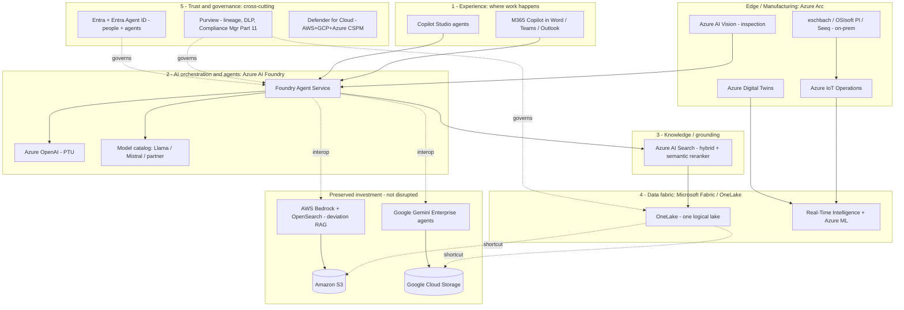

# Merck (MSD) - Future-State AI Architecture on Azure

### Translating business pressures into a target-state Azure architecture - without disrupting existing cloud investment

*Public sources, as of June 2026. Companion to `Merck-AI-Intelligence-Brief.md`.*

> **Scope:** Merck & Co., Inc. (Rahway, NJ; "MSD" outside US/Canada). Future-state architecture maps each documented business pressure to the highest-value Azure use case, while preserving Merck's existing Google Cloud (Gemini Enterprise) and AWS (Bedrock) investments.
>
> **Confidence tags:** **[V]** = verified / public source - **[H]** = hypothesis, validate live.

---

## Design principles (the "don't disrupt" guardrails)

1. **Federate, don't migrate** - Gemini Enterprise and AWS Bedrock stay in production; Azure AI Foundry *interoperates* with them (model endpoints / MCP / A2A).
2. **Data in place** - OneLake shortcuts read **Amazon S3 + Google Cloud Storage** natively; no ETL, no egress, no re-platforming.
3. **Edge via Arc** - eschbach Shiftconnector, OSIsoft PI and Seeq stay on-prem, connected through Azure Arc.
4. **One governance plane is the net-new value** - Entra + Purview + Defender span all three clouds; that is what makes the speed gains *audit-credible* (Merck's #1 constraint).

---

## 1. Business pressure points (from the slides + brief)

| ID | Business pressure | Source |
| --- | --- | --- |
| **P1** | **Keytruda 2028 patent cliff** (~$29.5B, ~46% of 2024 sales) - defend revenue + COGS + speed at once | BioSpace, Sep 2025 |
| **P2** | **Submission speed = revenue** - each day earlier ~ $1-3M | Yseop, 2026 |
| **P3** | **Data integrity / audit credibility gates everything** (FDA/EMA) | Rephine, Sep 2025 |
| **P4** | **Investigations & documentation = top regulatory pain** | ISPE iSpeak, Nov 2025 |
| **P5** | **Scientists stuck copyediting** (talent leakage) | R. Kim, CTO Merck (NAM, Mar 2025) |
| **P6** | **AI-at-scale arms race** vs peers | Sanofi, Jun 2023 |
| **P7** | **Value-capture gap** - only 24% of firms (10% in medtech) realize GenAI value; pilots != production | BCG Mar 2025; Fierce Pharma Jun 2026 |
| **P8** | **Supply chain resilience** - cold chain, shortages | Merck "5 ways" (Jan 2026); slide 3 |

---

## 2. Pressure -> best-fit use case -> future-state Azure

| Pressure | Best-fit use case (from docs) | Future-state Azure service | Existing investment preserved | Outcome target |
| --- | --- | --- | --- | --- |
| **P2** Submission speed | AI regulatory authoring (CSR / eCTD first drafts) | M365 Copilot + **Foundry Agent Service** + **Azure AI Search**; Azure OpenAI **PTU** | GPTeal patterns map onto Foundry endpoints | CSR 180->80 hrs, 50% fewer errors **[V]** |
| **P4** Investigations & docs | Deviation / CAPA investigation agent | Foundry Agent + **AI Search** RAG over deviation history | **Keep AWS Bedrock + OpenSearch**; OneLake shortcut to its S3 | 30-50% faster deviation closure **[V]** |
| **P5** Scientists copyediting | Author -> review drafting copilots | **M365 Copilot in Word** + Copilot Studio | Coexists with GPTeal | Reclaim scientist hours **[V]** |
| **P3** Data integrity / audit | Trust & governance plane (cross-cutting) | **Purview** + Compliance Manager (Part 11) + **Entra Agent ID** (four-eyes) | Governs AWS / GCP data too | Audit trail on every prompt & output **[V]** |
| **P8** Supply resilience | Predictive quality + risk-sensing | **Fabric Real-Time Intelligence** + Azure ML + **Digital Twins** | eschbach / PI / Seeq via **Arc** (no rip-replace) | <30-min disruption risk assessments **[V]** |
| **P1** COGS / cliff defense | Mfg predictive quality + batch-record automation | **Azure AI Vision** + Azure ML + Foundry | Keeps **Visual Factory**; Arc to edge | Batch-record errors -70% **[V]** |
| **P6** AI-at-scale | Enterprise agent platform at scale | Foundry + Copilot Studio + **Entra Agent ID** (75k+ staff) | Governs Gemini agents under one identity | Scale beyond pilots **[V]** |
| **P7** Value-capture gap | AI landing zone + evaluation + FinOps gates | **Azure AI Landing Zone** + Foundry evaluations + App Insights + Cost Mgmt | Wraps all three clouds | Move past 24% -> production value **[V problem]** |
| **R&D** discovery | Target ID / molecular design | Foundry **model catalog** + Azure ML + **Microsoft Cloud for Healthcare** (Mayo multimodal) | Keeps partner models (Variational AI, Protillion) | Pipeline speed-to-insight **[V]** |

---

## 3. Future-state reference architecture

Azure adds the **experience, orchestration, knowledge, data-fabric and governance** planes; AWS Bedrock and Google Gemini stay live and are reached via Foundry *interop* and OneLake *shortcuts*; on-prem GxP systems join through Arc. The governance plane wraps everything - the precondition for letting speed gains scale.

---

## 4. How existing investment is preserved

| Existing asset | Status | How it connects to Azure |
| --- | --- | --- |
| **Google Gemini Enterprise** agents | Keep in production | Federated via **Entra** identity, governed by **Purview**; Foundry invokes as agent/model endpoint (interop) |
| **AWS Bedrock + OpenSearch** (deviation RAG) | Keep in production | **OneLake shortcut** to its S3 data (no copy); Foundry orchestrates across both over time |
| **On-prem / edge GxP** (eschbach, OSIsoft PI, Seeq) | Keep on-prem | Connected via **Azure Arc + IoT Operations**; no rip-and-replace |
| **GPTeal** secure LLM gateway | Coexist | Foundry becomes the strategic gateway; GPTeal patterns map onto Foundry endpoints |

**Net:** Gemini and Bedrock stay where they deliver today; Azure becomes the productivity surface (M365 Copilot), the audit/identity backbone (Entra + Purview), and the data fabric (OneLake) - finally answering "who owns the quality-data backbone across three clouds."

---

## 5. Risks / caveats (so it survives a CTO review)

- **"Better than" is workload-specific.** Lead with the four defensible Azure edges: M365-native agents, end-to-end auditability/identity (Purview + Entra Agent ID), OpenAI frontier models, and OneLake multicloud virtualization - not raw model benchmarks.
- **Depends on Merck being an M365 / Entra shop** - very likely at their scale, but **validate** before leaning on desktop-incumbency. **[H]**
- **GxP qualification is shared-responsibility.** Microsoft provides Part 11 / GAMP 5 guidance and Compliance Manager templates, but validation stays Merck's. Azure *accelerates* validation; it does not remove it.
- **Current-state unknowns** (SAP ERP, OSIsoft PI/Seeq, cloud QMS) are **[H]** pending confirmation.
- **Regulatory acceptance, data privacy, model governance in GMP, and partner dependency** remain the top enterprise risks (see brief).

---

## 6. Sources & confidence

> *Forward-looking or single-company figures (e.g., "up to $1B," program timelines, outcome targets) are stated announcements/ceilings - directionally reliable, magnitude to be validated against future disclosures.*

| # | Item | Source |
| --- | --- | --- |
| 1 | Merck AI use cases (foundation models, CV, <30-min risk assessments) | Merck - "5 ways we're transforming AI into impact" (Jan 2026) |
| 2 | Internal gen-AI CSR platform (180->80 hrs, 50% fewer errors) | Merck press release (Jun 2025); McKinsey/Merck |
| 3 | Mayo Clinic multimodal collaboration | Merck press release (Feb 2026) |
| 4 | MSD-Google Cloud ($1B, Gemini Enterprise) | MSD press release (Apr 2026) |
| 5 | Generative-AI deviation management on AWS Bedrock + OpenSearch | AWS Machine Learning Blog (Nov 2025) |
| 6 | Visual Factory / eschbach Shiftconnector | PR Newswire (Oct 2025) |
| 7 | Value-capture gap (24% / 10% medtech) | BCG (Mar 2025) |
| 8 | OneLake shortcuts to Amazon S3 + Google Cloud Storage (GA) | Microsoft Fabric documentation / Fabric blog |
| 9 | Microsoft Entra Agent ID (identity & governance for AI agents) | Microsoft Ignite 2025 |
| 10 | Pressure quotes (submission speed, copyediting, data integrity, FDA pain) | Yseop 2026; NAM Mar 2025; Rephine Sep 2025; ISPE Nov 2025 |

*Prepared for the Company Intelligence Lead / Architecture Transformation Program. All figures and dates reflect publicly reported information at the time of writing.*