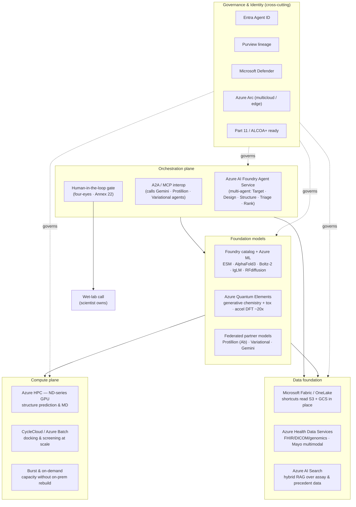

# UC1 Solution Design — Multi-Step Discovery Orchestration

*Use Case 1 of the Merck AI-First architecture · Cloud-Centric Platform for governed agentic drug discovery*
*Companion to: `UC1-Discovery-Outcomes-Citations.md` · Source deck: [Merck AI-First — Three Use Cases](https://rajesh-ms.github.io/aifirstbeta-pharma/#1)*

| | |
|---|---|
| **Document** | Solution Design (SD) |
| **Use case** | UC1 — Multi-Step Discovery Orchestration (R&D / Discovery) |
| **Status** | Draft v1.0 |
| **Date** | 25 June 2026 |
| **Owners** | Solution Architecture (Microsoft) · Merck Research Labs (sponsor) |

---

## 1. Purpose & scope

Define the target-state technical design for a **governed, multi-step agentic drug-discovery platform** that orchestrates protein/antibody and foundation models across Azure, Google, and AWS, and hands a ranked candidate shortlist to a human gate before any wet-lab work.

**In scope:** discovery orchestration from Target ID → in-silico triage → human gate; the orchestration, foundation-model, compute, data, and governance planes; multicloud federation; compliance controls (Annex 22, Part 11 / ALCOA+).

**Out of scope:** wet-lab execution, clinical trial systems (UC2/UC3 cover regulatory authoring and quality investigations), commercial/manufacturing workloads.

---

## 2. Business context

UC1 targets the **first business pressure** named in the customer report-out — **"R&D productivity + time-to-market"** — for which the deck maps the acting AI trend to *"AI target discovery, molecule design, portfolio decisioning"* with the proof point *"12–18 mo to clinic vs 4–6 yr; 173 AI programs in clinic (2026)"* (deck slide 3, *Where AI moves each pressure*). The Benefit Dependency Canvas (slide 5) ties this to the investment drivers behind the program: the **Keytruda 2028 cliff**, **~$3B savings by 2027**, **speed-to-patient**, **FDA/EMA AI scrutiny**, and **~20 launches ahead**.

The platform exists to **refill the pipeline before the 2028 Keytruda cliff** by compressing discovery and increasing the number of validated candidates per cycle, without compromising regulatory trust. Target outcomes (see citations brief):

- **12–18 months to clinic** vs a 4–6 year norm (industry benchmark).
- **More validated candidates per cycle**, at portfolio scale.
- **~46% of revenue** exposure addressed at the cliff.
- **Human owns the wet-lab call** — AI triages, the human approves (four-eyes, Annex 22).

---

## 3. Design principles

1. **Integrate, don't displace.** Federate across the multicloud AI Merck already owns (~$1B+ in Google Cloud, Protillion, Variational bets); do not rip and replace.
2. **AI accelerates, humans decide.** Every regulated decision has a human owner; GenAI never makes the critical call (Annex 22).
3. **Govern by default.** Identity, lineage, and audit are cross-cutting, not bolted on.
4. **Federate data, don't migrate it.** Read S3 + GCS in place via OneLake shortcuts.
5. **Composable agents.** Each pipeline stage is an independent, swappable agent invoked via open protocols (A2A / MCP).
6. **Inspection-ready from research onward.** Part 11 / ALCOA+ provenance on every candidate.

---

## 4. Solution overview

A multi-agent orchestration runs the discovery pipeline as five governed stages, with a mandatory human gate before wet-lab:

```
Target ID & validation → Generative design → Structure & docking → In-silico triage → Rank → HUMAN GATE → (wet-lab, scientist owns)
```

The orchestration spans four technical planes plus a cross-cutting governance & identity plane.

---

## 5. Logical architecture



---

## 6. Agent pipeline design

| Stage | Agent | Primary models / services | Output | Human role |
|---|---|---|---|---|
| 1 | **Target ID & validation** | Multimodal target agent | ESM, Azure Health Data Services (Mayo multimodal), AI Search RAG | Candidate targets + evidence | Target go / no-go |
| 2 | **Generative design** | Design agent | RFdiffusion, IgLM, Variational (Enki), Protillion (Prot-MaP) | Scaffolds / sequences | Which to synthesize |
| 3 | **Structure & docking** | Structure agent | AlphaFold3, Boltz-2, ABodyBuilder; Azure HPC ND-series | Predicted structures, docking scores | — (AI accelerates) |
| 4 | **In-silico triage** | Triage agent | Azure Quantum Elements (tox/chemistry), Batch screening | Filtered candidate set (flags non-synthesizable/toxic) | — (AI accelerates) |
| 5 | **Rank → human gate** | Ranking agent + HITL | Foundry Agent Service, scoring policy | **Ranked shortlist** | **Approve shortlist (four-eyes)**; wet-lab call |

**Principle:** AI triages at portfolio scale; the scientist owns the wet-lab call. Everything is traced.

---

## 7. Component design by plane

### 7.1 Orchestration plane
- **Azure AI Foundry Agent Service** hosts the five-agent workflow with deterministic control flow, retries, and state.
- **A2A / MCP interoperability** lets the orchestrator call external partner agents (Gemini for R&D reasoning, Protillion for antibody design, Variational for small molecules) as governed tools.
- **Human-in-the-loop gate** pauses the workflow at Stage 5; approval is a signed, audited event (four-eyes per Annex 22).

### 7.2 Foundation models plane
- **Foundry model catalog + Azure ML** serve open models (ESM, AlphaFold3, Boltz-2, IgLM, RFdiffusion) as managed endpoints.
- **Azure Quantum Elements** provides generative chemistry and accelerated DFT (~20×) for tox/property prediction.
- **Federated partner models** invoked in place via A2A — no model migration.

### 7.3 Compute plane
- **Azure HPC (ND-series GPU)** for structure prediction and molecular dynamics.
- **CycleCloud / Azure Batch** for large-scale docking and screening.
- **Burst & on-demand** scaling — additional capacity without an on-prem rebuild (no capex).

### 7.4 Data foundation
- **Microsoft Fabric / OneLake shortcuts** read **S3 + GCS in place** (GA) — federate, don't migrate.
- **Azure Health Data Services** for FHIR/DICOM/genomics, including Mayo multimodal data.
- **Azure AI Search** for hybrid RAG over assay and precedent data.

### 7.5 Governance & identity (cross-cutting)
- **Entra Agent ID** — every agent has a managed identity; least privilege; full audit.
- **Microsoft Purview** — end-to-end data and decision lineage on every candidate.
- **Microsoft Defender** — threat protection across the estate.
- **Azure Arc** — governs multicloud / edge resources under one control plane.
- **Part 11 / ALCOA+** provenance — attributable, legible, contemporaneous, original, accurate records.

---

## 8. Data flow

1. Target agent pulls multimodal + precedent data (OneLake shortcuts to S3/GCS, AHDS, AI Search) → proposes targets.
2. Design agent generates scaffolds/sequences (open + partner models).
3. Structure agent predicts structures and docks on HPC/Batch.
4. Triage agent scores synthesizability and toxicity (Azure Quantum Elements).
5. Ranking agent produces a shortlist → **human gate** → approved candidates flow to wet-lab.
6. Every step emits lineage to Purview and audit events keyed to the agent's Entra Agent ID.

---

## 9. Multicloud federation design

The deck's recommendation is **"Federate, don't migrate"** — Azure as the governance + data fabric *over* Google and AWS, preserving the spend Merck has already made (deck slide 9). UC1 adopts the same four federation planes:

| Plane (deck slide 9) | Azure service | Role in UC1 |
|---|---|---|
| **Identity** | Microsoft Entra + Agent ID | One Zero-Trust identity for scientists **and** agents across Azure, AWS, GCP, SaaS |
| **Governance** | Purview + Defender for Cloud | Lineage / DLP + security posture across AWS + GCP + Azure — makes every candidate decision audit-credible |
| **Data** | Microsoft Fabric / OneLake | Shortcuts virtualize **S3 + GCS in place** — no ETL, no egress, no migration |
| **Control** | Azure Arc | Manage Kubernetes, servers & data running in AWS / GCP / on-prem from Azure |

- **Keep AWS** (e.g., Bedrock RAG) and **keep Google Cloud** (Gemini Enterprise agents) where they deliver today; **Azure adds the four planes** above rather than displacing them.
- **Models:** partner agents (Gemini on Google, Protillion/Variational) are invoked via **A2A/MCP** as governed tools; outputs are captured with Purview lineage and keyed to each agent's Entra Agent ID.

---

## 10. Governance, compliance & security design

| Control area | Requirement | Design response |
|---|---|---|
| **Critical-decision boundary** | GenAI prohibited for critical GxP decisions (Annex 22) | Human gate at Stage 5; AI is decision-support only |
| **Human oversight** | Human-in-the-loop mandatory | Signed four-eyes approval, audited |
| **Data integrity** | ALCOA+ / 21 CFR Part 11 | Immutable audit trail, Purview lineage per candidate |
| **Identity** | Least privilege, attributable actions | Entra Agent ID per agent; scoped RBAC |
| **Performance equivalence** | Prove AI ≥ manual baseline (Annex 22) | Baseline metrics captured before go-live; ongoing monitoring |
| **Threat protection** | Secure agent + data estate | Microsoft Defender; network isolation; managed endpoints |

---

## 11. Non-functional requirements

| NFR | Target |
|---|---|
| **Scalability** | Portfolio-scale concurrent pipelines via Batch/CycleCloud burst |
| **Auditability** | 100% of candidate decisions traceable to source + identity |
| **Availability** | Orchestration plane 99.9%; compute is elastic/best-effort |
| **Reproducibility** | Versioned models, prompts, data snapshots per run |
| **Cost control** | On-demand burst with an HPC cost-steward function; no capex |
| **Latency** | Triage cycles tuned for human-gate review cadence, not real-time |

---

## 12. Key design decisions

| # | Decision | Rationale | Alternative considered |
|---|---|---|---|
| D1 | Azure AI Foundry Agent Service as orchestrator | Native multi-agent, governance integration | Custom orchestration framework |
| D2 | Federate via A2A/MCP rather than re-host partner models | Protects existing bets; faster | Migrate models to Azure |
| D3 | OneLake shortcuts over data migration | Read S3/GCS in place; no duplication | ETL into Azure |
| D4 | Human gate at rank stage only | Balances throughput with Annex 22 critical-decision rule | Gate at every stage (too slow) |
| D5 | Entra Agent ID + Purview as the spine | Reused across UC1–UC3; one governance story | Per-app bespoke governance |

---

## 13. Assumptions, dependencies & risks

**Assumptions:** OneLake shortcuts to S3/GCS are GA and approved for use; partner agreements permit A2A invocation; reference datasets are accessible.

**Dependencies:** Entra Agent ID availability; Foundry Agent Service capacity; HPC ND-series GPU quota; partner model endpoints (Gemini, Protillion, Variational).

**Risks:** (see implementation plan for mitigations) — Annex 22 performance-equivalence evidence; GPU capacity; partner-model SLAs; data-residency across clouds.

---

## 14. Out of scope

Wet-lab execution, LIMS/ELN integration beyond candidate hand-off, clinical and manufacturing systems (covered by UC2/UC3), and commercial analytics.

---

## 15. Grounding & traceability

This design is grounded in the customer report-out deck — *["Grounded in the Customer — Merck (MSD): Business Pressures First"](https://rajesh-ms.github.io/aifirstbeta-pharma/)* — and the research `.md` files behind it. In the spirit of the deck's own *Assumptions vs Facts vs Must-Validate* slide (slide 6), the design separates deck-verified capability from discovery-specific positioning:

- **Deck-verified Azure services** (slide 8 *Why Azure* · slide 9 *Federate, don't migrate*): AI Foundry Agent Service, Azure OpenAI in Foundry, Azure AI Search (hybrid + semantic reranker), Microsoft Fabric / OneLake shortcuts over S3 + GCS (Verified · GA), Purview + Compliance Manager, Microsoft Entra Agent ID, Defender for Cloud, Azure Arc.
- **Business-pressure grounding** (slides 2–5): the Keytruda 2028 cliff (~$29.5B, ~46% of 2024 sales), ~$3B savings by 2027, the R&D-productivity pressure and its *12–18 mo / 173-program* proof point, and the Annex 22 / 21 CFR Part 11 / ALCOA+ "four-eyes" guardrails.
- **Discovery-specific solution extensions** (not asserted by the deck; consistent with the research and to be validated with the customer per slide 6): Azure Quantum Elements, Azure HPC ND-series + CycleCloud/Batch, Azure Health Data Services (Mayo multimodal), and the open discovery models (ESM, AlphaFold3, Boltz-2, RFdiffusion, IgLM).

*See `UC1-Discovery-Outcomes-Citations.md` for the full citation set and independent web verification of the outcome claims.*
