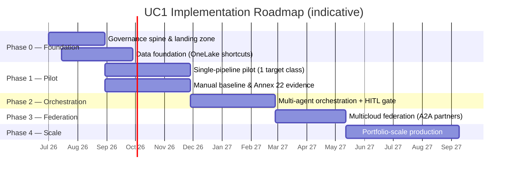

# UC1 Solution Implementation Plan — Multi-Step Discovery Orchestration

*Companion to: `UC1-Solution-Design.md` and `UC1-Discovery-Outcomes-Citations.md`*
*Source deck: [Merck AI-First — Three Use Cases](https://rajesh-ms.github.io/aifirstbeta-pharma/#1)*

| | |
|---|---|
| **Document** | Solution Implementation Plan (SIP) |
| **Use case** | UC1 — Multi-Step Discovery Orchestration (R&D / Discovery) |
| **Status** | Draft v1.0 |
| **Date** | 25 June 2026 |
| **Sponsor** | Merck Research Labs · Microsoft Solution Architecture |

---

## 1. Purpose

Provide a phased, low-risk path to deliver the UC1 target state defined in the Solution Design — from a governed foundation through a single-pipeline pilot to portfolio-scale production — while proving Annex 22 performance equivalence and protecting existing multicloud investments.

This plan is grounded in the customer report-out deck — *["Grounded in the Customer — Merck (MSD): Business Pressures First"](https://rajesh-ms.github.io/aifirstbeta-pharma/)* (slides 2–5 for pressures, outcomes and drivers; slide 8 for the Azure stack mapping; slide 9 for the "federate, don't migrate" four-plane model) — and the research `.md` files behind it.

---

## 2. Approach & guiding principles

- **Land the governance spine first**, then add capability. Identity, lineage, and audit precede agents.
- **Prove value on one target class** before scaling to the portfolio.
- **Federate early** — read S3/GCS in place and call partner agents rather than migrate.
- **Human-in-the-loop from day one** — the gate is built in the pilot, not retrofitted.
- **Measure against a manual baseline** to satisfy Annex 22 performance-equivalence.

---

## 3. Workstreams

1. **Platform & Governance** — Entra Agent ID, Purview, Defender, Arc, Part 11/ALCOA+ controls.
2. **Data Foundation** — Fabric/OneLake shortcuts, Azure Health Data Services, AI Search.
3. **Models & Compute** — Foundry catalog, Azure ML endpoints, Quantum Elements, HPC/Batch.
4. **Agent Orchestration** — Foundry Agent Service pipeline, A2A/MCP partner integration, HITL gate.
5. **Adoption & Operating Model** — new roles, training, change management, cost stewardship.

---

## 4. Phased roadmap

---

## 5. Phase detail

### Phase 0 — Foundation & governance baseline (≈ Months 0–3)
- **Deliverables:** Azure landing zone established as the deck's **four federation planes** (slide 9) — **Identity** (Entra + Agent ID), **Governance** (Purview lineage + Defender for Cloud + Part 11/ALCOA+ control mapping), **Data** (Fabric/OneLake shortcuts to S3/GCS), **Control** (Azure Arc); plus an AI Search index over assay/precedent data.
- **Exit criteria:** every planned agent identity provisioned; lineage captured on a test dataset; S3/GCS readable in place; security review passed.

### Phase 1 — Single-pipeline pilot (≈ Months 3–6)
- **Deliverables:** end-to-end pipeline for **one target class** (Target ID → Rank) with a working **human gate**; open models served (ESM, AlphaFold3, RFdiffusion, IgLM); manual **baseline metrics** captured for Annex 22.
- **Exit criteria:** ranked shortlist approved by a scientist via four-eyes; full audit trail; AI shown ≥ manual baseline on agreed metrics.

### Phase 2 — Multi-agent orchestration (≈ Months 6–9)
- **Deliverables:** all five agents on Foundry Agent Service; Azure Quantum Elements triage; HPC/Batch burst; retries/state/observability.
- **Exit criteria:** automated multi-stage runs with one human gate; reproducible runs (versioned models/prompts/data).

### Phase 3 — Multicloud federation (≈ Months 9–11)
- **Deliverables:** A2A/MCP integration of **Gemini, Protillion, Variational** agents as governed tools; lineage across clouds; Arc-governed resources.
- **Exit criteria:** partner-model outputs captured with full provenance; data residency validated; SLAs agreed.

### Phase 4 — Scale to production & portfolio (≈ Months 11–15)
- **Deliverables:** concurrent portfolio-scale pipelines; HPC cost-steward controls; operational runbooks; production support model.
- **Exit criteria:** sustained throughput at portfolio scale; cost within budget; production governance sign-off.

---

## 6. Team & roles (RACI)

| Role | Phase 0 | Phase 1 | Phase 2 | Phase 3 | Phase 4 |
|---|---|---|---|---|---|
| Solution Architect | A/R | A/R | A/R | A/R | A |
| Platform / Governance Eng | R | C | C | C | C |
| Data Engineer | R | R | C | C | C |
| **In-silico triage scientist** (new) | C | R | R | R | R |
| **Model-catalog curator** (new) | C | R | R | R | C |
| **Biologics agent-ops engineer** (new) | I | R | R | R | R |
| **HPC cost steward** (new) | C | C | R | C | A/R |
| Discovery Scientist (decision owner) | I | A | A | A | A |
| Quality / Regulatory (Annex 22) | C | A/R | C | C | A |

*New roles are drawn from the deck's persona slide. A = Accountable, R = Responsible, C = Consulted, I = Informed.*

---

## 7. Governance & human-in-the-loop gates

| Gate | When | Owner | Criterion |
|---|---|---|---|
| **G0 — Security & governance** | End of Phase 0 | Platform/Governance | Identity, lineage, audit operational |
| **G1 — Pilot value + Annex 22** | End of Phase 1 | Quality/Regulatory | AI ≥ manual baseline; four-eyes works |
| **G2 — Orchestration ready** | End of Phase 2 | Solution Architect | Reproducible multi-agent runs |
| **G3 — Federation assured** | End of Phase 3 | Quality + Security | Cross-cloud provenance & residency OK |
| **G4 — Production sign-off** | End of Phase 4 | Sponsor | Throughput, cost, governance met |

---

## 8. Success metrics / KPIs

| KPI | Baseline | Target |
|---|---|---|
| Time from Target ID to clinic-ready candidate | 4–6 years | **12–18 months** |
| Validated candidates per cycle | Current | **Increase** at portfolio scale |
| Late-stage failure rate (pre-lab triage effect) | Current | **Reduce** (AI Phase I success 80–90% vs 40–65% conventional) |
| Candidate decisions with full lineage | — | **100%** |
| Annex 22 performance-equivalence evidence | None | **Documented** before each go-live |
| Incremental compute capex | — | **$0** (burst / on-demand) |

---

## 9. Cost & licensing considerations

- **Consumption-based** Azure HPC/Batch with burst — opex, not capex; governed by the HPC cost steward.
- **Foundry Agent Service + Azure ML** endpoint costs scale with usage.
- **Partner models** billed under existing Merck agreements (Gemini, Protillion, Variational) — federated, not re-licensed.
- Aligns with Merck's **$3B-by-2027** savings program (avoid duplicate infra; no data migration).

---

## 10. Risks & mitigations

| # | Risk | Likelihood | Impact | Mitigation |
|---|---|---|---|---|
| R1 | Annex 22 performance-equivalence evidence not documentable | Med | High | Capture manual baseline in Phase 1; ongoing monitoring |
| R2 | GPU (ND-series) capacity constraints | Med | Med | Reserve quota early; Batch burst; multi-region |
| R3 | Partner-model SLA / availability | Med | Med | A2A retries; fallbacks to open Foundry models |
| R4 | Cross-cloud data residency / compliance | Med | High | OneLake shortcuts (no copy); residency validation in Phase 3 |
| R5 | Adoption — scientists keep "running tools" | Med | Med | New roles + change management; decision-support UX |
| R6 | Cost overrun on burst compute | Med | Med | HPC cost steward; budgets, alerts, autoscale caps |

---

## 11. Dependencies & assumptions

- **Dependencies:** Entra Agent ID, Foundry Agent Service capacity, HPC GPU quota, OneLake shortcut GA, partner endpoints, Quality/Regulatory availability for gates.
- **Assumptions:** partner agreements permit federated invocation; reference datasets accessible; sponsor commitment to the new operating roles.

---

## 12. Summary

UC1 lands in five phases over ~15 months: **govern → pilot → orchestrate → federate → scale.** Value is proven on one target class with a human gate and an Annex 22 baseline before any portfolio-scale rollout — accelerating discovery while keeping a human owner on every regulated decision and protecting Merck's existing multicloud AI investments.
